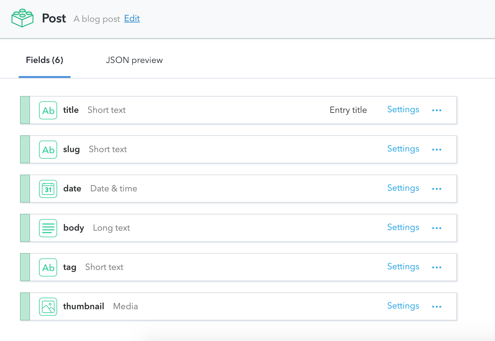

Hey! 👋 I'm Joe Hines, a Computer Science student at Drexel University.
This is a personal blog for any writing that I feel like sharing, and this is my first post!
I set out to make this blog when a coworker brought up <elink to="https://www.gatsbyjs.org">Gatsby.js</elink> while helping me learn React.
Before then, I had briefly heard about static site generation.
To me, decoupling a site's design from its content without using a database seemed tricky even given the potential upsides.
However, after becoming comfortable with React, implementing a static site with Gatsby was a matter of hooking up plugins and making simple templates.
As I see it, the benefits to this approach are the following:

- _Almost_ No learning
  - If you know React, then you can make a site with Gatsby.
  - Configure your gatsby-config.js, write a handful of components, and let your data drive the generation of your site.
  - You can do complicated things with the generation of your site, and the final bundle will still be small.
- Speed
  - The blazing speed of a site made with Gatsby is apparent from the first page load.
    - (I hope you noticed when you first came here)
  - When comparing the user experience of a static site like this one with that of a site like <elink to="https://medium.com">Medium</elink>, the difference is night and day.
  - More important than just making the desktop experience enjoyable, the static approach allows mobile users to interact with the site easier.
  - A smaller bundle with virtually no JavaScript allows even those of us with the slowest 3G to browse without issue.
- Independence
  - As long as you have access to a computer that can serve static pages, you can keep your site online.
  - No depending on external servers to be up and secure.
  - This allows individuals to maintain robust, powerful sites without the influence of third parties.
  - There are no Terms of Service to follow when you write your content (as long as you don't break any laws).
  - The ability to posses sole control of a site is something that more people should value.

By this point, you might be asking:

## How do I get started with Gatsby?

Personally, I cloned the <elink to="https://github.com/gatsbyjs/gatsby-starter-default">Gatsby Starter Template</elink> and made modifications to get rolling.
Before you touch the code, however, there are a few key elements of any Gatsby project that you should know about:

**Conceptual**
_The Data_

- Loosely formatted (often markdown) data to be displayed on the site.
- In the case of a blog, the data is the collection of 'posts', where each 'post' is a markdown file.
- Gatsby can access this data from a multitude of places but the two most common cases are locally and through a CDN/CMS.
- I am using <elink to="https://www.contentful.com/">Contentful</elink> to host all of my data.

_The Generator_

- The generator is the code that takes the raw data, and applies transforms to it before outputting html to be rendered in the browser.
- In this case, the markdown of the blog post content is transformed into html and formatted.

**Practical**

- _Gatsby Config_
  - gatsby-config.js is the file where all plugins are defined, as well as basic metadeta for the whole site.
  - These plugins determine what data will be available to your components
- _Default Pages_
  - These are the default pages that will be built, regardless of the data present.
  - In my case, this is an index page, which renders a list of the posts, and a 404 page.
  - <elink to="https://github.com/josephthomashines/personal-blog/tree/master/src/pages">See src/pages</elink>
- _Generated Pages_
  - These are the pages that are generated based on the input data.
  - In this case, each post generates a page that displays all of its content.
  - <elink to="https://github.com/josephthomashines/personal-blog/tree/master/gatsby-node.js">See gatsby-node.js</elink>
- _Templates/Components_
  - These are the React (.jsx/.tsx) files that specify how to render the data.
  - I have a blog post template, as well as a generic layout wrapper that is present on each page
- _Assets and Style_
  - Just like with any other static site, SCSS/CSS is used for styling.
  - I keep repeated images (like my logo) in here as well.

**_NOTE_**: I use TypeScript in my implementation, but vanilla JS can also be used with Gatsby.

## So, what's first?

- First become familiar with the following, assuming you already know JavaScript and Node.js

  - <elink to="https://reactjs.org">React</elink>
    - Gatsby provides a React interface for building our components.
    - If you don't like or want to learn React, you should check out other static site generators, such as the ones listed on <elink to="https://www.staticgen.com/">this site</elink>
    - Some resources to learn React:
      - <elink to="https://reactjs.org">React</elink>
      - <elink to="https://hackernoon.com/react-js-a-better-introduction-to-the-most-powerful-ui-library-ever-created-ecd96e8f4621">Ilya Suzdalnitski on Hackernoon</elink>
      - <elink to="https://medium.freecodecamp.org/learning-react-roadmap-from-scratch-to-advanced-bff7735531b6">Srebalaji Thirumalai for freeCodeCamp</elink>
  - <elink to="https://graphql.org/">GraphQL</elink>
    - We will be using GraphQL to 'query' for our data from our sources
    - GraphQL is, as the name suggests, a query language.
      Facebook developed it to be a REST replacement/aggregator, but works well within the context of Gatsby
    - Some resources to learn GraphQL:
      - <elink to="https://graphql.org/learn">GraphQL Learn</elink>
      - <elink to="https://medium.com/@kalin.chernev/the-guide-to-learn-graphql-i-wish-i-found-few-months-go-97f9d9ca6f12">Kalin Chernev on Medium</elink>

- Next, now that you are familiar with the related technologies, assuming you have node.js + npm/yarn already installed:
  - <elink to="AAAA">Install Gatsby</elink>
    - run `npm install gatsby -g` or `yarn global add gatsby`
  - Clone the <elink to="https://github.com/gatsbyjs/gatsby-starter-default">Gatsby Starter Template</elink>
  - Go to the starter's directory
  - Run `npm run start` or `yarn start`, both of which will just run `gatsby develop`
  - Go to `http://localhost:8080` to see your site!

**NOTE**: The Gatsby Development Lifecycle

The data is grabbed and made into pages at the `build` step.
So, `gatsby develop` will only watch and compile your React and Styling (with hot reloading),
but to see any changes you make in your data or your page generation config,
you will need to kill the instance of `gatsby develop` with Ctrl+C and re-run it.

Congrats! You are set up with a basic project that you know how to run. From this point forward, I am just going to detail the steps I took in the order I took them, but none of this is required.

## Adding a CMS

As mentioned above, I am using <elink to="https://www.contentful.com/">Contentful</elink> to make and host my data.

I chose this method because I feel as though it has the most transferable value.
By this I mean that an implementation using a seperate CMS is close to what I would do for something like a small business website.
This solution would allow me to make a site for a client that they could 'maintain' without ever having to see a line of code or contact me.
In order to leverage this service, I need to configure my Contentful data model as well as set up my project to access it.

To do this, first go to Contentful and make an account.
After setting this up, create yourself a blank space.
A `space` is an area that encapsulates all of your data for a certain project.
My space for this blog contains posts and assets such as images.
In Contentful, you create a 'Content Model' to define each type of content.
This model contains the fields that make up the content, as well as each field's properties.
The model is used to generate the UI that Contentful provides for you to enter your data.
An instance of a Content Model is referred to as an 'entry'.
In the case of this blog, I have one content type, a Post.
After navigating to the Content Model tab,
I defined a post as follows:



While title, date, body, and tag are easily interpretted (as they comprise the data that is displayed to the reader),
there is a possibly ambiguous `slug` field.
A slug refers to the end of a url used to specify a page, or in this case a post.
This page's slug is `/building-this-blog`
You can define these on your own, using a combination of post date and title to ensure you never duplicate them,
but by allowing contentful to autogenerate this field you can avoid all of that work.
Contentful, if told this field is also to be unique, will not allow a post to be created if another entry in the current space has a slug that matches.
This catches the issue before a single line of code is run, greatly reducing the chances of an error during build time.

Now that my model is defined, I can start creating content.
At first, I created a handful of posts in order to have enough data to test my design.
Believe it or not, none of these posts came close to the caliber of the one you are currently reading 🤓 .
After writing each post, make sure to click the green 'Publish' button in order to make your content available.

## Grabbing Content

Now that we have made our content and published it online, we need to pull that data into our site as it builds.
In this case, I used `gatsby-source-contentful`.
We need to `npm install gatsby-source-contentful --save` or `yarn add gatsby-source-contentful`.
After the plugin is installed, go into your `gatsby-config.js` and make the following change.

```js
module.exports = {
  siteMetadata: {
    name: 'josephhines',
    tagline: 'Writing code, among other things.',
  },
  plugins: [
    'gatsby-plugin-react-helmet',
    {
      resolve: `gatsby-source-filesystem`,
      options: {
        name: `images`,
        path: `${__dirname}/src/images`,
      },
    },
    'gatsby-transformer-sharp',
    'gatsby-plugin-sharp',
    {
      resolve: `gatsby-plugin-manifest`,
      options: {
        name: 'Joseph Hines Personal Blog',
        short_name: 'josephhines',
        start_url: '/',
        background_color: '#663399',
        theme_color: '#663399',
        display: 'minimal-ui',
        icon: 'src/images/logo.png',
      },
    },
    'gatsby-transformer-remark',
    'gatsby-plugin-sass',
    {
      // highlight-line
      resolve: `gatsby-source-contentful`, // highlight-line
      options: {
        // highlight-line
        spaceId: process.env.CONTENTFUL_SPACE_ID, // highlight-line
        accessToken: process.env.CONTENTFUL_DELIVERY_ACCESS_TOKEN, // highlight-line
      }, // highlight-line
    }, // highlight-line
  ],
}
```

We have one last thing to do before this plugin is ready to go.
As you may have noticed, there are two options specified, and both of them reference `process.env.something`.
The `spaceId` and `accessToken` are secret information. A person with these two things has complete access to your space.
So in order to keep these safe, we are setting them as 'environment variables'.
Environment variables are **NEVER** checked in to any code store and are never to be kept in plain text in the code.
Otherwise, anyone with access to the code (which is everyone in the case of a public repository like this one), can have unrestricted access to your content space.
So we can use a little package called `dotenv` to help us keep these keys private.

Install with `npm install dotenv --save` or `yarn add dotenv`.
Then, create a file at the root of your project called `.env` (hence the name dotenv).
Go back to Contentful and go to the setting tab at the top and choose API keys.
Once you find the SpaceID and DeliveryAccessToken, open up .env and add the following:

```js
CONTENTFUL_SPACE_ID = 'your spaceId goes in here'
CONTENTFUL_DELIVERY_ACCESS_TOKEN = 'and your delivery access token goes here'
```

Finally, to access these variables inside our `gatsby-config.js`, we need to add:

```js
require(`dotenv`).config({ path: `.env` }) //highlight-line

module.exports = {
  siteMetadata: {
    name: 'josephhines',
    tagline: 'Writing code, among other things.',
  },
  plugins: [
    'gatsby-plugin-react-helmet',
    {
      resolve: `gatsby-source-filesystem`,
      options: {
        name: `images`,
        path: `${__dirname}/src/images`,
      },
    },
    'gatsby-transformer-sharp',
    'gatsby-plugin-sharp',
    {
      resolve: `gatsby-plugin-manifest`,
      options: {
        name: 'Joseph Hines Personal Blog',
        short_name: 'josephhines',
        start_url: '/',
        background_color: '#663399',
        theme_color: '#663399',
        display: 'minimal-ui',
        icon: 'src/images/logo.png',
      },
    },
    'gatsby-transformer-remark',
    'gatsby-plugin-sass',
    {
      resolve: `gatsby-source-contentful`,
      options: {
        spaceId: process.env.CONTENTFUL_SPACE_ID,
        accessToken: process.env.CONTENTFUL_DELIVERY_ACCESS_TOKEN,
      },
    },
  ],
}
```

Now when you build your site, the keys will be loaded from `.env` and used to get your Contentful data.

**NOTE**: Never check in this .env file. _Ever._

Now, if we run `yarn start` and navigate to `localhost:8080/___graphql` we can test and see if we can access our data.
_This_ is one of the best things about using GraphQL.
This playground with not only allow you to test queries, but also will aid you in auto-completing them, allowing you to figure out your queries quickly and easily.
In this case, the `gatsby-source-contentful` plugin adds a few fields, but the first one to get you up an going is the `allContentfulNAME` field; where NAME is the name of a content type.
In our case, this field is `allContentfulPost`.
Under this object, you have access to every field you defined in you content model.
For example, this query would return the title of every post:

```js
{
    allContentfulPost {
        edges {
            node {
                title
            }
        }
    }
}
```

So in our index file, we want to load some information to serve as a list of all of the available posts.
This is the query in my index file:

```js
query IndexPageQuery {
    site {
      siteMetadata {
        name
        tagline
      }
    }
    allContentfulPost(sort: { fields: [date], order: DESC }) {
      edges {
        node {
          title
          slug
          date
          tag
          thumbnail {
            fixed(width: 2000, height: 1000) {
              tracedSVG
              src
            }
          }
        }
      }
    }
  }
```

- query IndexPageQuery: gives the query a name.
- site.siteMetadata: this object contains the data from the siteMetadata object from `gatsy-config.js`
  - I keep the name of my site and its tagline here, so that I can keep it consistent around the site.
- allContentfulPost(sort: { fields: [date], order: DESC }): gets all of the posts in descending chronological order (the first post is the most recent)
  - I get all of the data I have about every post, except the body content.

To make this query run in a component, we need the following:

```tsx
import { graphql } from 'gatsby'

export const indexPageQuery = graphql`
  query IndexPageQuery {
    site {
      siteMetadata {
        name
        tagline
      }
    }
    allContentfulPost(sort: { fields: [date], order: DESC }) {
      edges {
        node {
          title
          slug
          date
          tag
          thumbnail {
            fixed(width: 2000, height: 1000) {
              tracedSVG
              src
            }
          }
        }
      }
    }
  }
`
```

The `graphql()` function takes in a query string and returns the results of the query.
This query string is wrapped in backticks (\`) which allows it to span multiple lines,
making it easier to read.

After defining this query, we need to define the props for our component.
Our props _exactly_ match the structure of the query (thanks GraphQL!),
except we also specify the TypeScript typings.
Our props are defined as:

```tsx
interface IndexPageProps {
  data: {
    site: {
      siteMetadata: {
        name: string
        tagline: string
      }
    }
    allContentfulPost: {
      edges: {
        node: {
          title: string
          slug: string
          date: Date
          tag: string
          thumbnail: {
            fixed(
              width: 2000,
              height: 1000,
            ): {
              tracedSVG: string
              src: string
            }
          }
        }
      }
    }
  }
}
```

To access this data in a component, we need to make sure to pass this interface in as the prop interface.
The component is defined as:

```tsx
export default class IndexPage extends React.Component<IndexPageProps, {}> {}
```

Now, within the class, we have access to the results of our query through the `this.props.data` object.
Finally, now that we have access to our data, we need to render it to the screen.
Here is the complete component, render methods and all:

```tsx
import * as React from 'react'
import { graphql, navigate } from 'gatsby'
import * as styles from '../style/index.module.scss'

import Layout from '../components/Layout'

interface IndexPageProps {
  data: {
    site: {
      siteMetadata: {
        name: string
        tagline: string
      }
    }
    allContentfulPost: {
      edges: {
        node: {
          title: string
          slug: string
          date: Date
          tag: string
          thumbnail: {
            fixed(
              width: 2000,
              height: 1000,
            ): {
              tracedSVG: string
              src: string
            }
          }
        }
      }
    }
  }
}

export const indexPageQuery = graphql`
  query IndexPageQuery {
    site {
      siteMetadata {
        name
        tagline
      }
    }
    allContentfulPost(sort: { fields: [date], order: DESC }) {
      edges {
        node {
          title
          slug
          date
          tag
          thumbnail {
            fixed(width: 2000, height: 1000) {
              tracedSVG
              src
            }
          }
        }
      }
    }
  }
`

export default class IndexPage extends React.Component<IndexPageProps, {}> {
  public renderPost(post: any, index: any): JSX.Element {
    return (
      <React.Fragment key={`post-preview-fragment-${index}`}>
        {post.thumbnail ? (
          <div key={index} className={styles.postPreview}>
            <div
              onClick={() => navigate(`/${post.slug}`)}
              role='link'
              tabIndex={0}
              className={styles.filter}
            >
              
              <h1>{post.title}</h1>
              <p>{post.tag}</p>
              <span>{post.date}</span>
            </div>
          </div>
        ) : (
          <div key={index} className={styles.postPreview}>
            <div
              // highlight-next-line
              onClick={() => navigate(`/${post.slug}`)}
              role='link'
              tabIndex={0}
              className={styles.filter}
            >
              <h1>{post.title}</h1>
              <p>{post.tag}</p>
              <span>{post.date}</span>
            </div>
          </div>
        )}
      </React.Fragment>
    )
  }
  public render(): JSX.Element {
    const { name, tagline } = this.props.data.site.siteMetadata

    // @ts-ignore
    const posts = this.props.data.allContentfulPost.edges.map(edge => edge.node)

    return (
      <Layout tagline={tagline} name={name}>
        <div className={styles.ContainerPreview}>
          {posts.map((post, index) => this.renderPost(post, index))}
        </div>
      </Layout>
    )
  }
}
```

And just like that, we source data from Contentful and pass it into a component for rendering.
Since Gatsby looks for `index.{tsx,jsx}` we are don't have to tell it where to look.
This components becomes your root page after Gatsby builds.

I've highlighted a line above, this is the wrapper div for each post's preview.
When this div is clicked, the `navigate` function is called.
This function is used to, as the name implies, navigate the user to a different page.
In this case, this links to the page the contains the full post;
so let's generate our pages.

## Making Pages

Page generation is, just as everything else with Gatsby, done at compile time.
This is accomplished through the `gatsby-node.js` file.
To make a page, we need a few things.
First, each page needs a unique URL/slug.
We already generate this through Contentful.
Next, we need to access our data, including our slug.
This means that we will need a query.
This query looks similar to our query from `pages/index.tsx` as we need to get some information from every post.

```jsx
{
  allContentfulPost(sort: { fields: \[date\], order: DESC }) {
    edges {
      node {
        contentful_id
        slug
      }
      next {
        contentful_id
      }
      previous {
        contentful_id
      }
    }
  }
}
```

The only key differences in this query are the next and previous fields.
I use these to link to the previous and next post, on each posts page.
You may notice that I am only grabbing the id's for each post.
This is done because my blog post component will use this ID to query for all of the data of that page, instead of passing it all through the page creation process.
In order to actually make the pages, we need to export the createPages method.
All this method does is grabs all of your data, and then calls the createPage function for each post.
Here is my gatsby-node.js file:

```js
const path = require(`path`)

exports.createPages = ({ graphql, actions }) => {
  const { createPage } = actions
  return new Promise((resolve, reject) => {
    graphql(`
      {
        allContentfulPost(sort: { fields: [date], order: DESC }) {
          edges {
            node {
              contentful_id
              slug
            }
            next {
              contentful_id
            }
            previous {
              contentful_id
            }
          }
        }
      }
    `).then(result => {
      if (!result.err) {
        result.data.allContentfulPost.edges.forEach(
          ({ node, next, previous }) => {
            createPage({
              path: node.slug, // highlight-line
              component: path.resolve(`./src/components/BlogPost.tsx`), // highlight-line
              context: {
                // highlight-line
                slug: node.slug, // highlight-line
                contentful_id: node.contentful_id, // highlight-line
                // Because posts are sorted in DESC order, the PREVIOUS post
                // chronologically is the NEXT one in DESC order
                next: previous ? previous.contentful_id : null, // highlight-line
                previous: next ? next.contentful_id : null, // highlight-line
              },
            })
          },
        )
        resolve() // highlight-line
      }
    })
  })
}
```

I've highlighted the content of my createPage call, as well as the `resolve()` call, which is necessary to make sure your code is run.
The two most important parameters come first.
The path specifies the path to the page, which is why we pass out slug;
all of these will be unique, thanks to our Contentful setup.
The component field is the path to the component used to render each page.
This component is much like the `pages/index.tsx` page, with the biggest difference being the use of query parameters.
Here is the query from `components/blogPost.tsx`

```tsx
  query($contentful_id: String!, $next: String, $previous: String) { // highlight-line
    site {
      siteMetadata {
        name
        tagline
      }
    }
    main: contentfulPost(contentful_id: { eq: $contentful_id }) { // highlight-line
      title
      slug
      date
      body {
        childMarkdownRemark { // markdown to html conversion provided by gatsby-transformer-remark
          html
        }
      }
      thumbnail {
        fixed(width: 2000, height: 1000) {
          tracedSVG
          src
        }
      }
    }
    next: contentfulPost(contentful_id: { eq: $next }) { // highlight-line
      title
      slug
      date
      tag
      thumbnail {
        fixed(width: 2000, height: 1000) {
          tracedSVG
          src
        }
      }
    }
    previous: contentfulPost(contentful_id: { eq: $previous }) { // highlight-line
      title
      slug
      date
      tag
      thumbnail {
        fixed(width: 2000, height: 1000) {
          tracedSVG
          src
        }
      }
    }
  }
```

In the first line I have highlighted, I am defining 3 query parameters.
These are three of the variables from the `context` field I passed to createPage.
In the query, we define them with the name of the field passed to `context`.
We can then access them elsewhere in the query using the \$ operator.
You can see this in the other lines I highlighted.
In these lines, you'll notice that I am using aliases at the front.
If your GraphQL query returns more than one of a type (and not inside an array), you must use aliases.
By aliasing something to `main`, its accessor in the result will be `main` instead of `contentfulPost`.
You can see this in the prop interface for this component:

```js
interface IndexPageProps {
  data: {
    site: {
      siteMetadata: {
        name
        tagline
      }
    }
    main: { // highlight-line
      title
      slug
      date
      body: {
        childMarkdownRemark: {
          html
        }
      }
      thumbnail: {
        fixed: {
          tracedSVG
          src
        }
      }
    }
    next: { // highlight-line
      title
      slug
      date
      tag
      thumbnail: {
        fixed: {
          tracedSVG
          src
        }
      }
    }
    previous: { // highlight-line
      title
      slug
      date
      tag
      thumbnail: {
        fixed: {
          tracedSVG
          src
        }
      }
    }
  }
}
```

Finally, all we have left to do is write out render functions.
Here is the complete `components/blogPost.tsx`

```tsx
import * as React from 'react'
import { graphql, navigate } from 'gatsby'
import * as styles from '../style/index.module.scss'

import Layout from '../components/Layout'

interface IndexPageProps {
  data: {
    site: {
      siteMetadata: {
        name
        tagline
      }
    }
    main: {
      title
      slug
      date
      body: {
        childMarkdownRemark: {
          html
        }
      }
      thumbnail: {
        fixed: {
          tracedSVG
          src
        }
      }
    }
    next: {
      title
      slug
      date
      tag
      thumbnail: {
        fixed: {
          tracedSVG
          src
        }
      }
    }
    previous: {
      title
      slug
      date
      tag
      thumbnail: {
        fixed: {
          tracedSVG
          src
        }
      }
    }
  }
}

export const blogQuery = graphql`
  query($contentful_id: String!, $next: String, $previous: String) {
    site {
      siteMetadata {
        name
        tagline
      }
    }
    main: contentfulPost(contentful_id: { eq: $contentful_id }) {
      title
      slug
      date
      body {
        childMarkdownRemark {
          html
        }
      }
      thumbnail {
        fixed(width: 2000, height: 1000) {
          tracedSVG
          src
        }
      }
    }
    next: contentfulPost(contentful_id: { eq: $next }) {
      title
      slug
      date
      tag
      thumbnail {
        fixed(width: 2000, height: 1000) {
          tracedSVG
          src
        }
      }
    }
    previous: contentfulPost(contentful_id: { eq: $previous }) {
      title
      slug
      date
      tag
      thumbnail {
        fixed(width: 2000, height: 1000) {
          tracedSVG
          src
        }
      }
    }
  }
`

export default class BlogPost extends React.Component<IndexPageProps, {}> {
  public renderPost(post: any, index: any): JSX.Element {
    return (
      <div key={index} className={styles.post}>
        <h1>{post.title}</h1>
        <span>{post.date}</span>
        <div className={styles.thumbnail}>
          
        </div>
        <div
          dangerouslySetInnerHTML={{
            __html: post.body.childMarkdownRemark.html,
          }}
        />
      </div>
    )
  }
  public render(): JSX.Element {
    const { name, tagline } = this.props.data.site.siteMetadata

    const post = this.renderPost(this.props.data.main, 0)
    const afterword = []

    if (this.props.data.previous) {
      afterword.push(
        <div
          key={this.props.data.previous.slug}
          className={`${styles.postPreview} ${styles.previous}`}
        >
          <div
            onClick={() => navigate(`/${this.props.data.previous.slug}`)}
            role='link'
            tabIndex={0}
            className={styles.filter}
          >
            
            <h1>{this.props.data.previous.title}</h1>
            <p>{this.props.data.previous.tag}</p>
            <span>{this.props.data.previous.date}</span>
          </div>
        </div>,
      )
    }

    if (this.props.data.next) {
      afterword.push(
        <div
          key={this.props.data.next.slug}
          className={`${styles.postPreview} ${styles.next}`}
        >
          <div
            onClick={() => navigate(`/${this.props.data.next.slug}`)}
            role='link'
            tabIndex={0}
            className={styles.filter}
          >
            
            <h1>{this.props.data.next.title}</h1>
            <p>{this.props.data.next.tag}</p>
            <span>{this.props.data.next.date}</span>
          </div>
        </div>,
      )
    }
    return (
      <Layout tagline={tagline} name={name}>
        {post}
        <div className={styles.afterword}>{afterword}</div>
      </Layout>
    )
  }
}
```

## Wrap Up

And just like that, you have a functioning static site generator that sources its data from a
CMS and builds a site!
What I haven't touched on is styling, but the starter we used comes with a style you can modify on your own.
Feel free to check out the entire source code below!

**EDIT (2019/01/23):** I have since removed the contentful source for this blog. I now source everything from inside of the src/static/ folder in the repository. This was only done as having an offline workflow for writing these blogs works best for me at the current time.

# Thanks for reading!

<elink to="https://github.com/josephthomashines/personal-blog">Source Code for this Website</elink>
