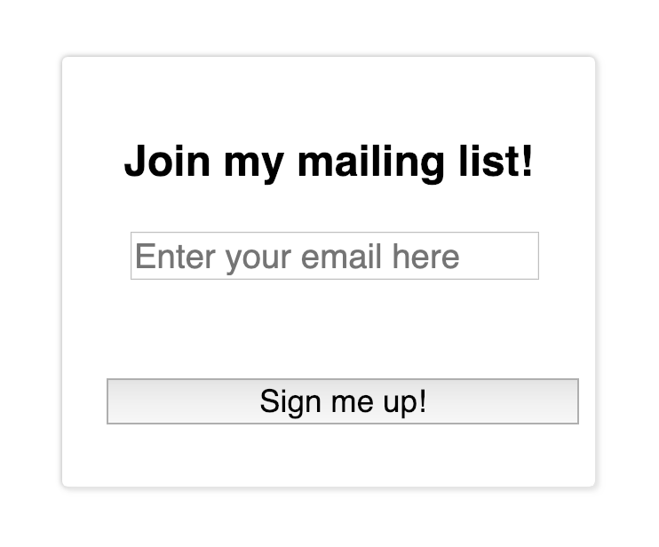
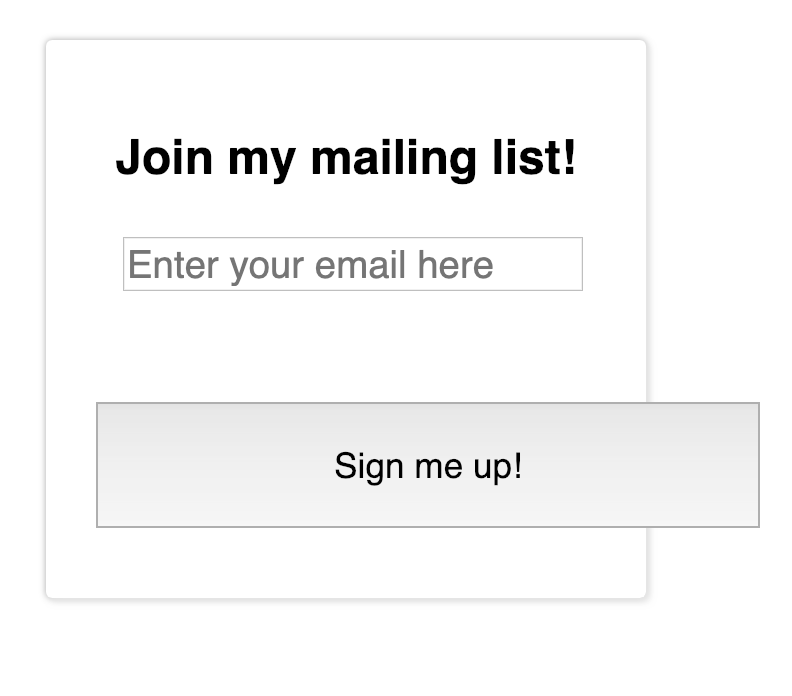
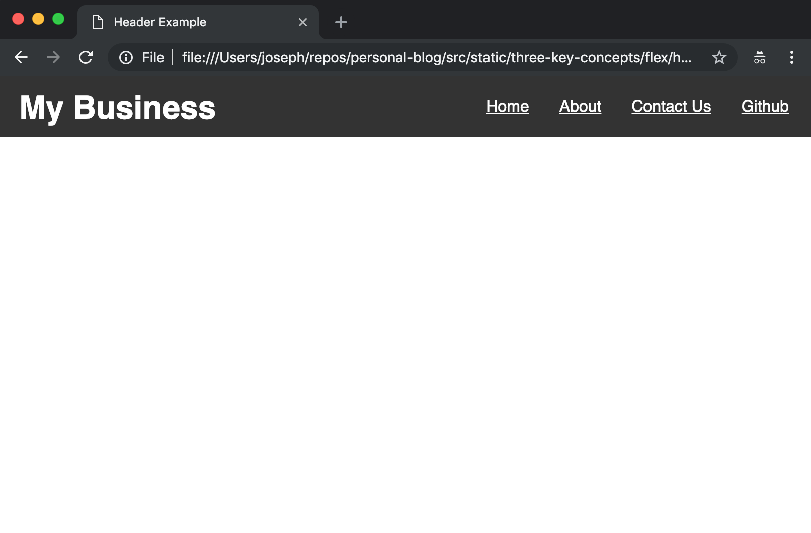
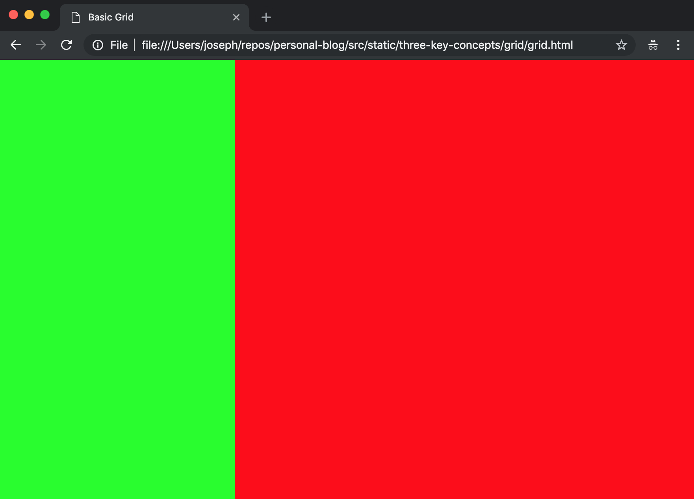

When I first became interested in programming as a freshman in high school, one of the first things I stumbled upon was web development.
I am fairly certain this came to be thanks to a search like _'How do I make a website?'_.
After tinkering a little with laying out HTML elements on a page, I realized that my site looked like it was from the 90's.
A few more equally eye-opening queries lead me to discover CSS.

**Great!** Now I can layout my page exactly how I want.
After successfully making a basic header and some body information, I was ecstatic!
That was until the idea crossed my mind to resize the browser window.
Turns out layouts based on absolute pixel locations are not exactly what one would call responsive.
Fast-forward to 2019, and I can proudly say that my ability to design and implement layouts have improved.

A few days ago, an idea popped into my head: <br />
**If I could go back to the beginning, what is one thing that I wish I knew?**

---

After some _serious_ silent reflection, I decided it would be knowing how to make simple, responsive layouts with CSS.
My learning process was filled with headaches and frustration, and I am better for having gone through it.
But here are my notes on this topic anyway!.

The 3 topics I would like to focus on are Border Box, Flex, and Grid.

# Border Box

```css
* {
  box-sizing: border-box;
}
```

## Why box-sizing: border-box?

As you probably know, HTML elements size is defined by a width and height property.
However, what counts as the width or height is often unclear.
Take a common example, adding some styling to a \<button\> tag.
Given a basic input form:

```html
<html>
  <head></head>
  <body>
    <form>
      <h2>Join my mailing list!</h2>
      <input type="text" placeholder="Enter your email here" />
      <button>Sign me up!</button>
    </form>
  </body>
</html>
```


Since I want to really grab the user's attention, I want to make my button nice and big.
This container is 300px, and I think 250px is how wide my button should be.



Something seems kind of off, but I just want some space around the text of the button, which is called padding.
I think 20px of vertical and 40px of horizontal padding sounds good.



Wait, what happened?

## What is box-sizing?

The box-sizing of an element is the bounding box for defining the dimensions of an element.
There are 4 properties of an element that affect its dimensions.
From the center of an element out they are: content, padding, border, margin.

When you define a height or width, you are specifying the size of the box.
In HTML, the default box-sizing value is content-box.
(Some browser mitigate this issue by forcing border-box as the default, but the HTML standard is still content-box)
This means that when you define a height or width, you are specifying the dimensions of the content.
Everything beyond the content, which is the padding, border, and margin is then considered outside the bounding box of the element.
Therefore if you have an element that is 100px by 100px, if you add 20px of padding, its _true_ dimensions are 140px by 140px.

So, by changing this box-sizing property, we can change how the dimensions of an element are calculated.
Choosing border-box takes the padding and border into consideration when determining the width and height.
This makes the most sense, as the padding and border can be considered a part of the element.
Take the example of the 100px by 100px element now, and apply 20px of padding to it.
Its dimensions will still be 100px by 100px, but the size of the content-box will be shrunk to 60px by 60px.

## Why is this applied on all elements?

Gone are the days of calculating margin between elements based on padding values.
By applying this to all elements on the page, we ensure that as long as we use non-negative values for our margin and padding no elements will overlap.
Many popular UI libraries such as
<elink to="https://getboostrap.com/">Boostrap</elink>
use this very technique to make layouts much more simple.

## Button Padding Example

Check out these links to see this in action:

[box-sizing: content-box]()

[box-sizing: border-box]()

All of the extraneous CSS is just to center everything so that when the box-sizing is changed, the difference becomes more apparent.

## Note

At the beginning of creating any stylesheet, the first thing I do is place the following at the top.

```css
* {
  padding: 0;
  margin: 0;
  border: none;
  box-sizing: border-box;
}
```

This ensures that every element on the page will behave the way I want and expect them to.

---

# Flex

```css
.my-class {
  display: flex;
}
```

## Why display: flex?

By declaring the display property as flex, we have defined our element to be a flexbox.
This makes our element a container that applies flex rules, only to its direct children.

## What is a flexbox?

A flexbox is a type of container that allows for organization of its children elements in a relative and therefore reactive manner.
Instead of relying on absolute pixel positions or percentages, we can simply use a flexbox.
I will not dig too deep here, and only intend to go over some basic things one would need to implemenet a flexbox in most cases.

Take the examples from above.
Notice how the form was centered both horizontally and vertically?
This was done using a flexbox.

## Organization patterns

When using flexboxes, there are a few things we must always do.
First, apply `display: flex;` to the container.
Next, define the height and width of this container.
(In the previous examples, the dimensions were 100vw x 100vh, or the size of the window).
After that, we can specify our justify-content property.
By default this allows us to control the left-right placement of the children, however this can be changed by altering the flex-direction.
Here we can also define a value for align-items, which is the up-down placement by default.
Finally, we can define the flex-wrap property, if we want our children to be automatically wrapped based on the size of the container.

## Smart wrapping

Flexboxes provide a way to intelligently wrap your elements when the size of their container shrinks.
A new row is automatically wrapped if:

- The window resizes and shrinks the container
- The next child element makes the total row width greater than the container

A key thing to remember is that this is true of the default flex-direction, changing it will make the above true, just with respect to columns and not rows.

## Usage

What has been mentioned above are the basic ideas that one needs in order to use a flexbox in most cases.
Getting more out of this display type mostly revolves around knowing what values each property can have and what they mean.

In order to use flexboxes to their full potential please [review this documentation](W3SCHOOLS).

## Header Example

When using flexboxes, you will often find yourself nesting layers of flexboxes;
the following is an example of how this can happen and how to handle it.



See the whole HTML document here:
[Header Example]()

---

# Grid

```css
.my-class {
  display: grid;
}
```

## Why display: grid?

## What is a grid?

### What is a grid area?

## Column-wise versus row-wise

## Side Panel Example

Here is a very simple way to layout a page with two containers, with one as a sidebar and the other as the main section.



---

# Combined

## Basic page with header, side panel with navigation, and main display;
